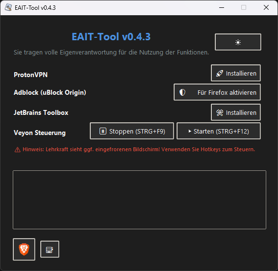

## ⚠️ Hinweis
Die Anwendung dieser Software liegt ausschließlich in der Eigenverantwortung der Nutzenden. Der Entwickler übernimmt keine Haftung für missbräuchliche oder zweckentfremdete Nutzung. Die enthaltenen Systemfunktionen dienen der technischen Steuerung und Wartung in Bildungs- und Testumgebungen.

# 🚀 EAIT-Tool

This Tool was created with the help of AI. A powerful and lightweight Windows tool designed for educational use – developed specifically for **EAIT**, with a focus on **autonomy, efficiency, and clean usability**.  
✨ **Fully portable** – no installation required, just run and go.

There are two available versions of this tool:

- **Standard Version** – includes extended features such as **Veyon control** and additional administrative tools.
    
- **Safe Version** – a minimal variant without **Veyon control features**, designed for environments where **simplicity and safety** are a priority.

## 📦 Version: `v0.4.2`  
📜 [View Changelog →](./CHANGELOG.md)

## 🧠 Features

✅ **Hotkey Control**  
→ Instantly pause or restart **Veyon** using global keyboard shortcuts

✅ **System Tray Icon & Visual Feedback**  
→ See at a glance whether Veyon is running or paused

✅ **ProtonVPN Portable Support**  
→ Quickly launch ProtonVPN without installation

✅ **JetBrains Toolbox Portable**  
→ Use your favorite IDEs on the fly

✅ **Brave Portable with uBlock Origin**  
→ Privacy-focused, ad-free browsing right out of the box

✅ **Dark / Light Mode Toggle**  
→ Switch the theme to match your workflow or mood 😎

✅ **Custom Cursor Design**  
→ Adobe-style cursor for that extra visual edge

✅ **Minimalistic & Robust UI**  
→ Clean, responsive design – built for functionality, not fluff

## ⚡ Hotkeys

| Shortcut         | Action                            |
|------------------|-----------------------------------|
| `Ctrl + F9`      | Pause all Veyon processes         |
| `Ctrl + F12`     | Restart/Resume Veyon processes    |

## ⚙️ Setup

No installation required.  
Simply run `EAIT-Tool.exe` on any Windows system.

> ⚠️ **Administrator privileges are required.**  
> When starting the tool, a prompt will appear asking whether to run it as administrator.  
> If declined, the application will exit with a message and cannot continue.

## ⚠️ COPYRIGHT DISCLAIMER:
The downloadable `.exe` file may contain official, unmodified installers from third-party software vendors 
(e.g. ProtonVPN, JetBrains Toolbox, Brave Browser), solely for educational/testing purposes.

We do not claim ownership or rights over these tools. All trademarks and software are owned by their respective developers.  
If required, these tools should be downloaded from their official sources.  
If this violates any distribution rights, please contact us and we will remove the release file immediately.
