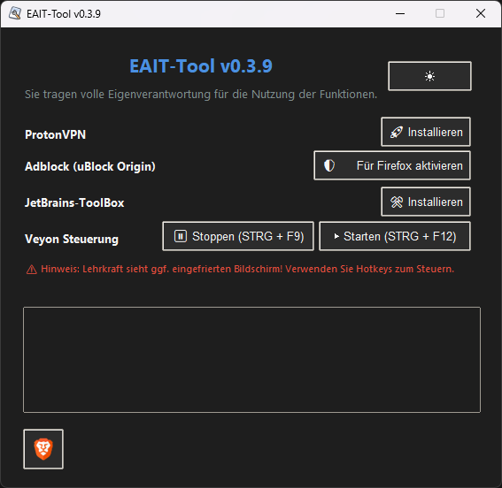

# 🚀 EAIT-Tool

A powerful and lightweight Windows tool designed for educational use – developed specifically for **EAIT**, with a focus on **autonomy, efficiency, and clean usability**.  
✨ **Fully portable** – no installation required, just run and go.

There are two available versions of this tool:

- **Standard Version** – includes extended features such as **Veyon control** and additional administrative tools.
    
- **Safe Version** – a minimal variant without **Veyon control features**, designed for environments where **simplicity and safety** are a priority.

## 📦 Version: `v0.4.2`  
📜 [View Changelog →](./CHANGELOG.md)

## 🧠 Features

✅ **Hotkey Control**  
→ Instantly pause or restart **Veyon** using global keyboard shortcuts

✅ **System Tray Icon & Visual Feedback**  
→ See at a glance whether Veyon is running or paused

✅ **ProtonVPN Portable Support**  
→ Quickly launch ProtonVPN without installation

✅ **JetBrains Toolbox Portable**  
→ Use your favorite IDEs on the fly

✅ **Brave Portable with uBlock Origin**  
→ Privacy-focused, ad-free browsing right out of the box

✅ **Dark / Light Mode Toggle**  
→ Switch the theme to match your workflow or mood 😎

✅ **Custom Cursor Design**  
→ Adobe-style cursor for that extra visual edge

✅ **Minimalistic & Robust UI**  
→ Clean, responsive design – built for functionality, not fluff

## ⚡ Hotkeys

| Shortcut         | Action                            |
|------------------|-----------------------------------|
| `Ctrl + F9`      | Pause all Veyon processes         |
| `Ctrl + F12`     | Restart/Resume Veyon processes    |

## ⚙️ Setup

No installation required.  
Simply run `EAIT-Tool.exe` on any Windows system.

> ⚠️ **Administrator privileges are required.**  
> When starting the tool, a prompt will appear asking whether to run it as administrator.  
> If declined, the application will exit with a message and cannot continue.

## 🙌 Disclaimer

**Use responsibly.**  
This tool was created to support educational autonomy and digital self-management.  
**It is not intended for misuse or deceptive purposes.**

## ⚠️ Legal Notice
This project does NOT include third-party software like ProtonVPN, Brave, or JetBrains Toolbox.  
All trademarks belong to their respective owners.  
Please download third-party tools from their official websites.
